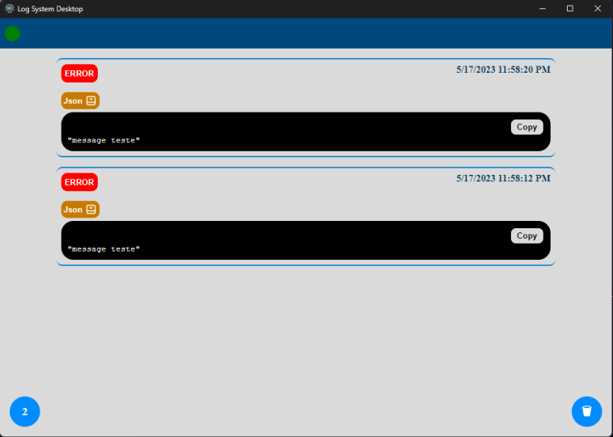

# Log System Desktop
This application allows what user define specify logs in code of your application.

### How to run
Is required install C++ to run this application with electron.

```cmd
    // To install libs
    yarn or npm install

    // To run application
    yarn start or npm run start

    // This application work only with log-system-device lib, to install run:

    yarn add log-system-device
      or
    npm install log-system-device
```
package in npm website [log-system-device](https://www.npmjs.com/package/log-system-device)

## Desktop App Preview


